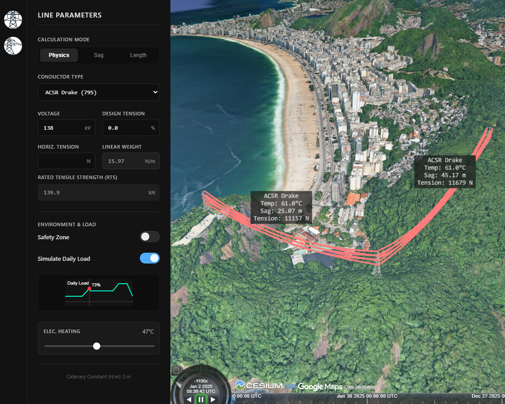

# Transmission Line Analysis Tool

Cesium Certified Developer submission by Gabriel Schettino Lucas

A web-GIS application for designing and analyzing overhead transmission lines using CesiumJS and Google Photorealistic 3D Tiles. This tool implements a real-time Catenary Solver to visualize conductor sag, tension, and thermal expansion based on physics simulations and local weather data.
